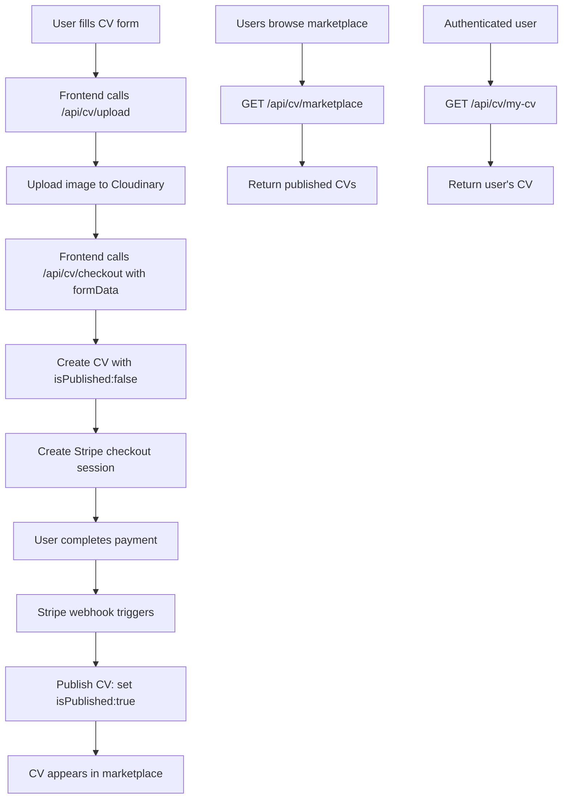

# CV Marketplace Backend Implementation Plan

## Overview
This plan outlines the implementation of backend API endpoints for CV submission and marketplace functionality. The system allows users to submit CVs after payment, and view published CVs in a marketplace.

## Current State Analysis
Based on code review, the following components are already implemented:
- CV model (needs updates for description and isPublished)
- Basic addCV controller (needs updates)
- Image upload endpoint with Cloudinary
- Stripe configuration
- Authentication middleware
- User model and database connection

## Architecture Diagram

## Database Schema Updates

### CV Model Updates
Add missing fields to match requirements:
- `description`: String (optional)
- `isPublished`: Boolean, default false

## API Endpoints Implementation

### Existing Endpoints
- `POST /api/cv/upload` - Upload profile image ✅
- `POST /api/cv` - Add CV (needs update for description)

### New Endpoints to Implement
- `POST /api/cv/checkout` - Create Stripe checkout session for CV submission ($4.99)
- `GET /api/cv/marketplace` - Retrieve all published CVs (no auth required)
- `GET /api/cv/my-cv` - Retrieve user's own CV (authenticated)
- `PUT /api/cv/publish/:cvId` - Publish CV after successful payment (internal/webhook)

## Payment Flow Details

1. User submits CV form with all data including uploaded image URL
2. Backend creates CV record with `isPublished: false`
3. Creates Stripe checkout session with:
   - Fixed price: $4.99
   - Metadata: `{ type: 'cv', cvId: cv._id }`
   - Success URL: frontend success page
   - Cancel URL: frontend cancel page
4. User completes payment on Stripe
5. Stripe sends webhook to `/api/checkout/webhook`
6. Webhook handler checks metadata, if type='cv', sets `isPublished: true` for the CV

## Implementation Steps

1. **Update CV Model**
   - Add `description` and `isPublished` fields

2. **Update Controllers**
   - Modify `addCV` to accept `description`
   - Add `checkoutCV` function
   - Add `getMarketplace` function
   - Add `getMyCV` function
   - Add `publishCV` function (for manual publishing if needed)

3. **Update Routes**
   - Add new route handlers in `routes/CV.js`

4. **Webhook Enhancement**
   - Modify existing webhook in `routes/checkout.js` to handle CV payments
   - Check session metadata for CV type and publish accordingly

5. **Testing**
   - Test image upload
   - Test CV creation
   - Test checkout session creation
   - Test payment flow and publishing
   - Test marketplace retrieval
   - Test my-cv retrieval

## Security Considerations
- All CV modification endpoints require authentication
- Marketplace view is public (no auth)
- Validate all input data
- Ensure users can only access/modify their own CVs

## Assumptions
- Frontend handles form validation
- Stripe webhooks are properly configured in production
- Cloudinary is set up for image storage
- User authentication is working

## Dependencies
All required dependencies are already installed:
- mongoose, stripe, multer, cloudinary, etc.

This plan provides a clear path to implement the CV marketplace functionality while building on existing infrastructure.